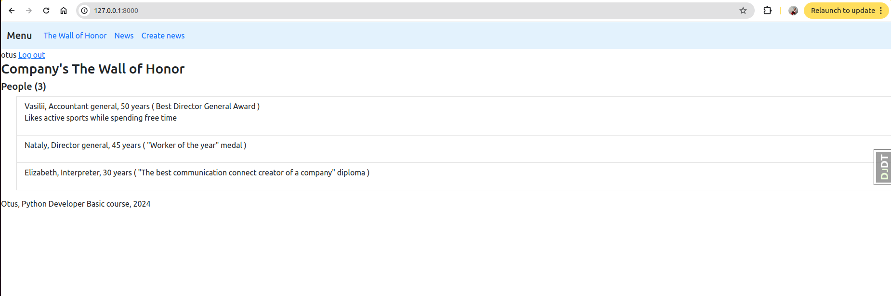
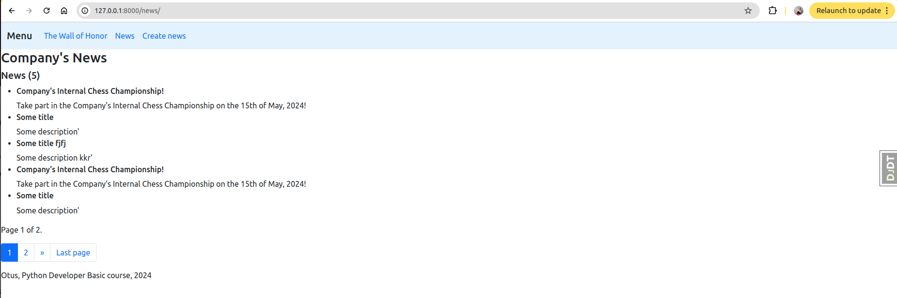

# otus-python-developer-basic-project
## Проектная работа по курсу "Python Developer Basic" на образовательной платформе "Otus".
## Тема: "Корпоративный блог".
Данный проект представляет собой web-приложение, написанное с использованием фреймворка **Django**.\
Используются следующие инструменты:
- Django
- база данных SQLite.\
С таблицами можно взаимодействовать. У таблиц есть связи.
- Bootstrap \
Созданы шаблоны с использованием Bootstrap.

### UI / UX приложения "Корпоративный блог"
Приложение представляет собой корпоративный портал, в который можно попасть после логина в аккаунт (создается админом).\
После успешного логина отображается главная и доступная всем страница - "The Wall of Honor". \
На ней есть:
- navbar с разделами "The Wall of Honor", "News", "Create news",
- кнопка выхода из аккаунта,
- заголовок,
- список людей с параметрами: возраст, должность, достижение, описание (если есть),
- footer

После нажатия на "News" в navbar открывается страница корпоративных новостей.\
Предусмотрен pagination. По страницам можно переходить кнопками внизу.

После нажатия на "Create news" в navbar открывается страница создания новостей с полями ввода заголовка и текста.\
Страница доступна не всем пользователям. Для этого админом выдаются права 'myapp | news | Can add news'.

Также предусмотрен url для перехода на страницу создания сотрудника с достижением.\
Предприняты попытки создания прототипа отправки письма (/send), который может в будущем (с учетом доработок) использоваться для, например, информирования сотрудников о новостях компании.

### Запуск приложения "Корпоративный блог"
Приложение запускается из папки /myproject командой:\
`python manage.py runserver`\
Предварительно можно заполнить базу данных:\
`python manage.py fill_db`\
Затем в браузере необходимо перейти на http://127.0.0.1:8000/
